# DNN Exam Ready Guide — AIMLCZG511

> **Closed book exam.** Each section: **original question** → **what it tests** → **step-by-step work** → **interpretation** → **exam answer**.

**Links:** [HTML version](DNN_Exam_Ready_Rendered.html) | [All PYQ HTML](DNN_All_PYQ_Complete_Solutions.html) | [Practice variants](DNN_Practice_Variant_Questions.html)

---

## If you only have 2–3 hours left

| Order | Topic | Time |
|:-----:|-------|:----:|
| 1 | Formula Sheet (below) | 15 min |
| 2 | EC2 Q1 Perceptron + Q3 Logistic | 25 min |
| 3 | EC2 Q4 Softmax + Q5 DFNN | 25 min |
| 4 | Mid Q2 CNN + Q4 GD | 15 min |
| 5 | BCE gradient + EC3 Q4 RNN | 25 min |

---

## STEP 0 — Golden Formulas

```
z = wᵀx + b          σ(z) = 1/(1+e^(-z))       ŷ = 1 if z≥0 else 0
∂L/∂z = ŷ − y        ∇w L = (ŷ − y)x
Perceptron: w ← w + η(y−ŷ)x     GD: w ← w − η∇L
Softmax: p_k = exp(z_k)/Σexp(z_j)    CCE: L = −log(p_true)
CNN: (N−F+2P)/S+1    Conv params: (F²·C_in+1)·C_out
Precision=TP/(TP+FP)  Recall=TP/(TP+FN)
dZ₂=A₂−Y  dW₂=dZ₂·A₁ᵀ  dZ₁=(W₂ᵀdZ₂)⊙(Z₁>0)  dW₁=dZ₁·Xᵀ
```

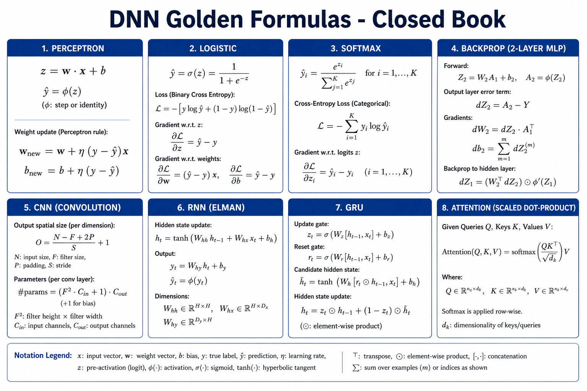

---

# PAPER 1 — EC2 Mid-Sem 2025 (Closed Book, 100 marks, 2 hrs)

---

## Question 1 — Perceptron

### Q1(a) [6 marks]

> **QUESTION:** Consider a perceptron with 2 input features. Current weights are w = [w₀, w₁, w₂] = [0.5, 0.3, −0.4] where w₀ is bias, w₁ for x₁, w₂ for x₂. A training example has x₁ = 1, x₂ = 2 with true label y = 1. Learning rate η = 0.1. Step activation: ŷ = 1 if z ≥ 0, else 0. Compute: (i) weighted sum z, (ii) predicted output ŷ, (iii) if misclassified, updated weights using perceptron learning rule (bias w₀ has input x₀ = 1).

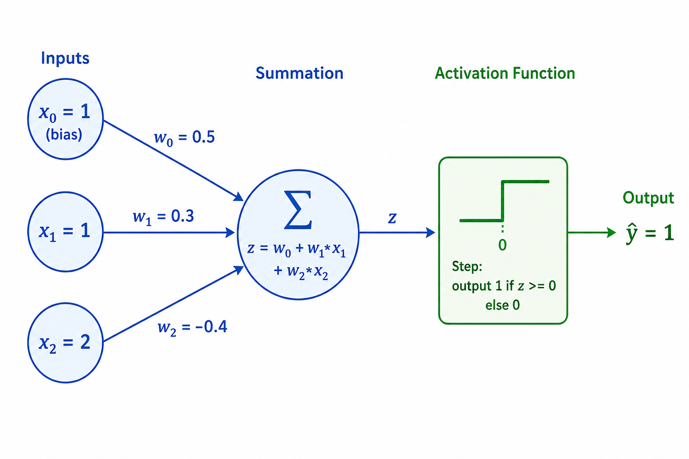

**What this tests:** Dot product with bias, step activation, and perceptron update rule — but only when wrong.

**Given:** w = [0.5, 0.3, −0.4], x = [1, 1, 2] (x₀=1 for bias), y = 1, η = 0.1

---

#### (i) Weighted sum z

The perceptron computes a weighted sum of all inputs (bias counts as x₀ = 1):

```
z = w₀·x₀ + w₁·x₁ + w₂·x₂
  = 0.5(1) + 0.3(1) + (−0.4)(2)
  = 0.5 + 0.3 − 0.8
  = 0.0
```

**Answer (i): z = 0.0**

---

#### (ii) Predicted output ŷ

Step rule: output 1 if z ≥ 0, else 0.

```
z = 0.0  →  0 ≥ 0 is TRUE  →  ŷ = 1
```

**Answer (ii): ŷ = 1**

---

#### (iii) Weight update

Perceptron rule (only when misclassified):

```
IF ŷ ≠ y:   w_j(new) = w_j(old) + η · (y − ŷ) · x_j
```

Check: y = 1, ŷ = 1 → **correctly classified** → no update.

**Answer (iii): Weights unchanged = [0.5, 0.3, −0.4]**

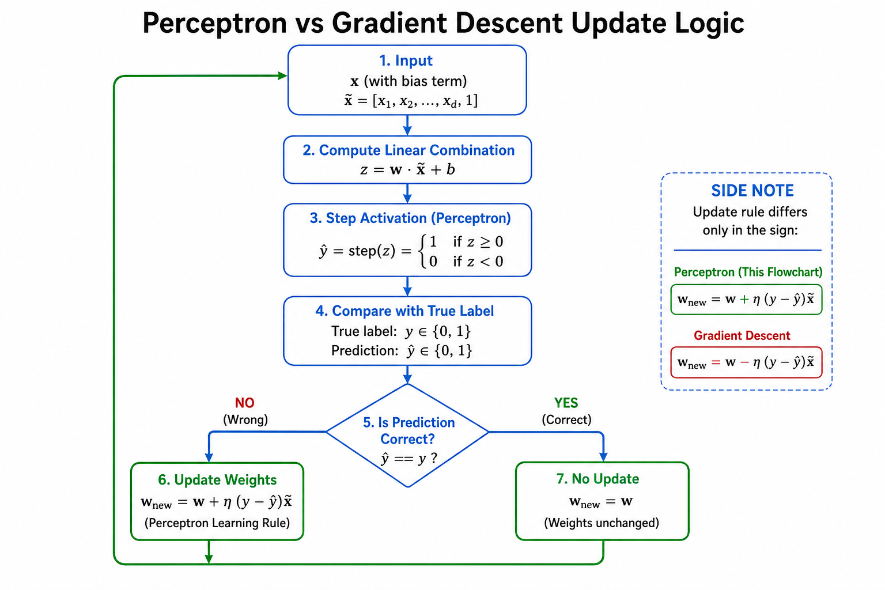

**Interpretation:** The model already predicts class 1 for this point. The perceptron only moves the boundary when it makes a mistake — correct predictions mean zero learning on this example.

**Exam answer:** z = 0.0, ŷ = 1, prediction matches label y = 1, so perceptron learning rule does not apply and weights stay [0.5, 0.3, −0.4].

**Exam tip:** Always compare ŷ vs y before updating. If they match, "no update" is the full answer — not a partial one.

---

### Q1(b) [6 marks]

> **QUESTION:** A spam classifier has weights w = [0.2, 0.8, 0.9, −0.5]ᵀ (bias, suspicious_words, links, length).  
> **(i)** Which feature most strongly indicates spam? Explain using weight magnitudes. [2 marks]  
> **(ii)** Model achieves 75% accuracy but stops improving. Explain what this reveals about linear separability and perceptron limitations. [4 marks]

#### (i) Strongest spam feature

**How to read weights:**
- **Positive weight** → increasing that feature pushes z higher → toward spam (class 1)
- **Negative weight** → pushes away from spam
- **Larger magnitude** → stronger influence

| Feature | Weight | Meaning |
|---------|--------|---------|
| suspicious_words | +0.8 | Strong spam signal |
| **links** | **+0.9** | **Strongest spam signal** |
| length | −0.5 | Longer emails → less spam |

**Exam answer:** **Links (weight = 0.9)** most strongly indicates spam — it has the highest positive weight, so each additional link increases the spam score more than any other feature.

#### (ii) 75% accuracy plateau

**Interpretation:**
1. The perceptron has **converged** to its best linear boundary — no further errors it can fix.
2. ~25% of data is likely **not linearly separable** — no single straight line can separate all spam from ham.
3. More epochs won't help — the model class is too weak, not the training time.
4. **Fix:** Use MLP with hidden layers to learn non-linear boundaries.

**Exam answer:** 75% plateau means the perceptron reached the ceiling for a linear classifier. The remaining 25% cannot be separated by any hyperplane, revealing non-linear separability. Perceptron cannot solve this — need MLP or richer features.

---

### Q1(c) [3 marks]

> **QUESTION:** 500 training reviews. Approach A: 5 features (sentiment words, exclamation marks, length, star rating). Approach B: 50 word-count features. Both 78% on training. Which generalizes better? Consider overfitting and interpretability.

| Factor | Approach A (5 features) | Approach B (50 features) |
|--------|------------------------|--------------------------|
| Samples per feature | 500/5 = **100** | 500/50 = **10** |
| Overfitting risk | Low | **High** |
| Interpretability | High (meaningful features) | Low (raw word counts) |

**Interpretation:** Both hit 78% on training, but B has only 10 samples per feature — it likely memorized word combinations that won't appear in new reviews. A uses domain-meaningful signals that transfer to unseen text.

**Exam answer:** **Approach A** generalizes better — more samples per feature reduces overfitting, and interpretable features (sentiment, rating) capture review quality rather than memorizing vocabulary.

---

### Q1(d) [5 marks]

> **QUESTION:** Complete the perceptron code blanks (Blank 1–5):

```python
z = ____________           # Blank 1
error = ____________       # Blank 2
weights = weights + ____________  # Blank 3
preds = ____________       # Blank 4
acc = ____________         # Blank 5
```

**Solution with reasoning:**

```python
Blank 1: np.dot(X[i], weights)        # weighted sum z for example i
Blank 2: y[i] - y_pred               # perceptron error (true − predicted)
Blank 3: learning_rate * error * X[i]  # PLUS — perceptron, not GD!
Blank 4: np.array([1 if np.dot(x, w) >= 0 else 0 for x in X])
Blank 5: np.mean(preds == y)          # fraction correct
```

**Exam tip:** Blank 3 uses **+** not **−**. Perceptron adds correction; gradient descent subtracts gradient. Don't mix them.

---

## Question 2 — Linear Regression

### Q2(a) [6 marks]

> **QUESTION:** Linear regression predicts house price ($1000s) from area (100s sq ft). Training data: Bias=1, Area=10, Price=150 and Bias=1, Area=20, Price=250. Weights: w₀=50, w₁=8, η=0.01. Perform one batch GD iteration: (i) predictions, (ii) MSE, (iii) gradient, (iv) update weights.

**What this tests:** Full batch GD loop — predict → loss → gradient → update.

**Given:** X = [[1,10],[1,20]], y = [150, 250], w = [50, 8], η = 0.01, N = 2

**Model:** ŷ = w₀ + w₁ · area

---

#### (i) Predictions

```
ŷ₁ = 50 + 8(10) = 50 + 80  = 130
ŷ₂ = 50 + 8(20) = 50 + 160 = 210
```

**Answer (i): ŷ = [130, 210]**

Both predictions are **below** actual prices (150, 250) — model under-predicts.

---

#### (ii) MSE Loss

```
MSE = (1/N) Σ(ŷᵢ − yᵢ)²
    = (1/2) [(130−150)² + (210−250)²]
    = (1/2) [400 + 1600]
    = 1000
```

**Answer (ii): MSE = 1000**

---

#### (iii) Gradient

Formula: `∇w = (1/N) · Xᵀ · (ŷ − y)`

```
ŷ − y = [130−150, 210−250] = [−20, −40]

Xᵀ(ŷ−y) = [[1,1],[10,20]] · [−20, −40]ᵀ
         = [−60, −1000]

∇w = [−60/2, −1000/2] = [−30, −500]
```

**Answer (iii): gradient = [−30, −500]**

Negative gradient → weights need to **increase** to raise predictions.

---

#### (iv) Weight update

```
w_new = w − η · ∇w
w₀ = 50 − 0.01(−30)  = 50.30
w₁ = 8  − 0.01(−500) = 13.0
```

**Answer (iv): w_new = [50.30, 13.0]**

**Interpretation:** Predictions were too low, so both bias and area weight increase — the model learns to predict higher prices next iteration.

**Exam answer:** ŷ = [130, 210], MSE = 1000, ∇w = [−30, −500], updated weights [50.30, 13.0].

---

### Q2(b) [5 marks]

> **QUESTION:** Complete batch gradient descent code blanks for linear regression.

```python
Blank 1: np.dot(X, weights)              # predictions ŷ = Xw
Blank 2: np.mean((y_pred - y)**2)        # MSE loss
Blank 3: np.dot(X.T, error) / N          # gradient (note: error = ŷ−y)
Blank 4: weights - lr * gradient         # GD update (MINUS for regression)
Blank 5: train_linear(X, y)              # function call
```

---

### Q2(c) [6 marks]

> **QUESTION:** Salary model: w₀=30000, w₁=2500 (education), w₂=3000 (experience).  
> **(i)** Predict salary for 4 years education, 2 years experience. Reasonable? [3 marks]  
> **(ii)** RMSE=$2,236 from MSE=5,000,000. Acceptable? [3 marks]

#### (i) Salary prediction

```
Salary = w₀ + w₁(education) + w₂(experience)
       = 30000 + 2500(4) + 3000(2)
       = 30000 + 10000 + 6000
       = $46,000
```

**Interpretation:** For 4 years education and 2 years experience, $46,000 is reasonable as an entry-to-mid level salary. The model values experience slightly higher ($3,000/yr vs $2,500/yr for education), which aligns with typical hiring practice.

**Exam answer:** Predicted salary = **$46,000**. This is reasonable for early-career positions — education and experience both contribute positively as expected.

#### (ii) RMSE acceptability

```
RMSE = √MSE = √5,000,000 ≈ $2,236
```

**Interpretation:** RMSE means the model's prediction is off by approximately **$2,236 on average**. For salaries in the $30,000–$150,000 range, this is ~4–7% error — acceptable for HR planning. It would **not** be acceptable if predicting hourly wages ($15–30/hr).

**Exam answer:** RMSE = **$2,236**. Yes, acceptable — error is small relative to typical salary range (~5%). Context matters: fine for annual salary, absurd for hourly wage prediction.

---

### Q2(d) [3 marks]

> **QUESTION:** Model A trained on original area (400–2000 sq ft). Model B on z-score normalized area. Same final weights and test MSE. Which trains faster? Explain via error surface shape.

**Key idea:** Normalization changes the **error surface shape**, not the final solution.

1. **Original features (400–2000):** Loss surface is elongated/elliptical — gradient zigzags slowly toward minimum.
2. **Z-score normalized (mean≈0, std≈1):** Surface becomes more circular — gradient points directly toward minimum.
3. **Same final MSE:** Both find the same optimum; only **convergence speed** differs.

**Exam answer:** **Model B** trains faster. Normalized features give a circular error surface → faster GD convergence. Same final weights/MSE confirms only speed differs, not accuracy.

---

## Question 3 — Logistic Regression

### Q3(a) [6 marks]

> **QUESTION:** Loan approval logistic regression. w₀=0, w₁=0.6 (credit), w₂=0.8 (income), η=0.1. One example: credit=0.7, income=0.5, approve=1. Calculate: (i) z, (ii) sigmoid probability, (iii) gradient, (iv) updated weights.

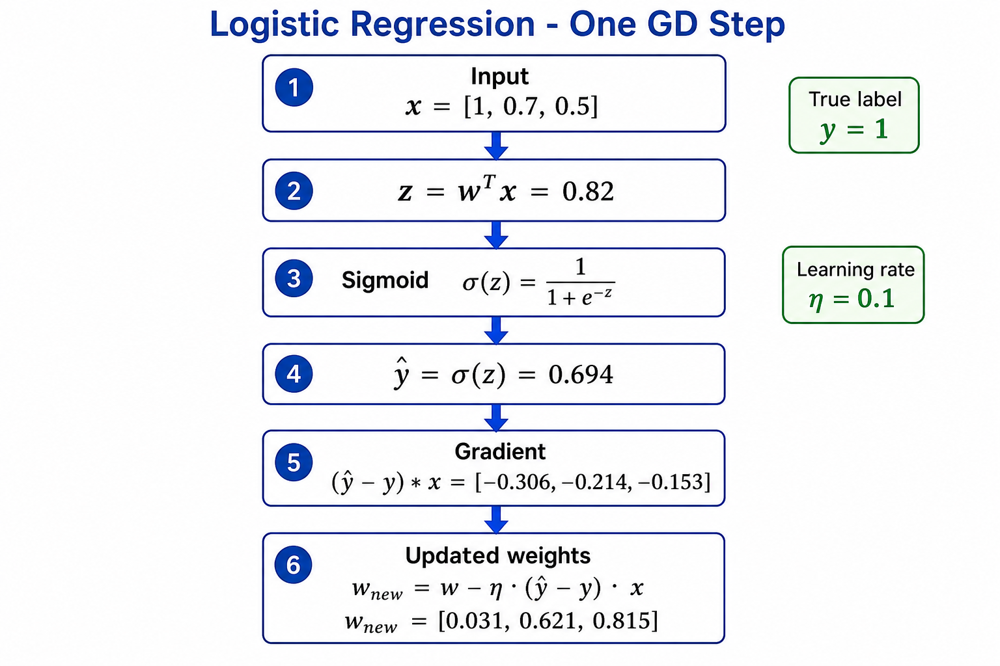

**Given:** w = [0, 0.6, 0.8], x = [1, 0.7, 0.5], y = 1, η = 0.1

---

#### (i) Weighted sum z

```
z = w₀(1) + w₁(0.7) + w₂(0.5)
  = 0 + 0.6(0.7) + 0.8(0.5)
  = 0.42 + 0.40 = 0.82
```

**Answer (i): z = 0.82**

Positive z → model leans toward approval before sigmoid.

---

#### (ii) Sigmoid probability

```
ŷ = σ(z) = 1 / (1 + e^(−0.82))
         = 1 / (1 + 0.4404)
         ≈ 0.694
```

**Answer (ii): ŷ ≈ 0.694 (69.4% approval probability)**

Model predicts approve, but with only 69.4% confidence — below the true label of 1.

---

#### (iii) Gradient

Using BCE shortcut: `∂L/∂w = (ŷ − y) · x`

```
∇w = (0.694 − 1) · [1, 0.7, 0.5]
   = (−0.306) · [1, 0.7, 0.5]
   = [−0.306, −0.214, −0.153]
```

**Why negative?** Model under-predicts (0.694 vs true 1). Negative gradient → after `w − η·∇w`, weights **increase** — correct direction.

**Answer (iii): gradient = [−0.306, −0.214, −0.153]**

---

#### (iv) Updated weights

```
w₀ = 0 − 0.1(−0.306) = 0.031
w₁ = 0.6 − 0.1(−0.214) = 0.621
w₂ = 0.8 − 0.1(−0.153) = 0.815
```

**Answer (iv): w_new ≈ [0.031, 0.621, 0.815]**

**Exam answer:** z = 0.82, σ(z) = 0.694, gradient = [−0.306, −0.214, −0.153], updated w ≈ [0.031, 0.621, 0.815]. Weights increase because model under-predicted approval.

---

### Q3(b) [5 marks]

> **QUESTION:** Complete mini-batch logistic regression code (sigmoid blank, y_pred, gradient, weight update, predict).

```python
Blank 1: 1/(1+np.exp(-z))                                    # sigmoid
Blank 2: sigmoid(z)                                          # probability
Blank 3: np.dot(X_batch.T,(y_pred-y_batch))/len(y_batch)   # gradient
Blank 4: weights - lr * gradient                             # GD update (MINUS!)
Blank 5: (sigmoid(np.dot(X,weights))>=0.5).astype(int)      # threshold at 0.5
```

**Exam tip:** Logistic uses **minus** (GD). Perceptron uses **plus**. Opposite signs — don't swap.

---

### Q3(c) [6 marks]

> **QUESTION:** 1000 patients: 50 diseased, 950 healthy. Threshold 0.5. TP=40, FN=10, FP=95, TN=855. Recall=80%.  
> **(i)** Calculate accuracy. Why is 89% misleading? What would always-healthy classifier get? [3 marks]  
> **(ii)** Why is recall more critical than precision for life-threatening disease? If threshold lowered 0.5→0.3, effect on FP and FN? [3 marks]

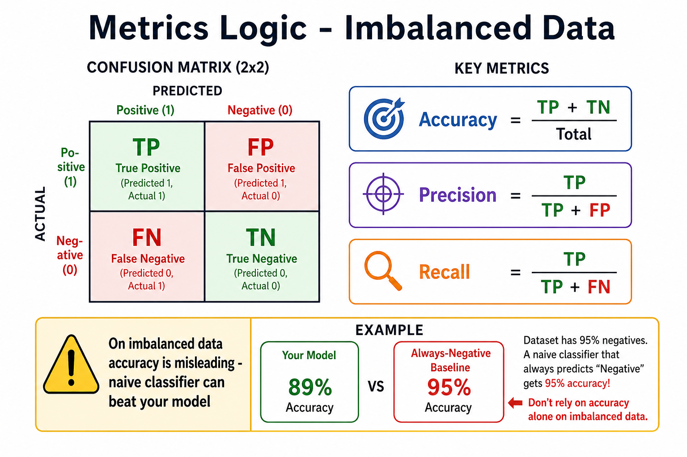

#### (i) Accuracy trap

```
Accuracy = (TP + TN) / Total = (40 + 855) / 1000 = 895/1000 = 89.5% ≈ 89%
```

**Interpretation:** 950/1000 patients are healthy. A **dummy classifier** predicting "healthy" always gets **95% accuracy** — beating our "smart" model at 89%! Accuracy hides poor disease detection.

**Exam answer:** Accuracy = **89%**. Misleading because 95% of data is healthy — naive always-healthy classifier achieves **95%**, outperforming this model. High accuracy does not mean good disease detection.

#### (ii) Recall vs threshold

**Why recall matters more:** False Negative (miss disease) → patient not treated → potentially fatal. False Positive (false alarm) → extra test → inconvenience but patient is safe. Cost of FN >> cost of FP.

**Lowering threshold 0.5 → 0.3:**
- Model predicts "disease" more easily
- **FP increases** (more healthy patients flagged)
- **FN decreases** (fewer diseased patients missed)
- Recall ↑, Precision ↓

**Exam answer:** Recall critical because missing disease is life-threatening. Lower threshold → FP increases, FN decreases, recall improves at cost of precision.

---

### Q3(d) [3 marks]

> **QUESTION:** 10,000 transactions, 500 fraud. Model A: 3 features, 95% acc, 60% fraud caught. Model B: 20 features, 96% acc, 75% fraud caught. Missed fraud=$100, false flag=$10 review. Which to deploy?

**Cost analysis:**

```
Model A: catches 300/500 frauds, misses 200 → 200 × $100 = $20,000 lost
Model B: catches 375/500 frauds, misses 125 → 125 × $100 = $12,500 lost
B saves: 75 extra frauds × $100 = $7,500
```

**Exam answer:** Deploy **Model B**. 75 extra frauds caught saves $7,500 — far exceeds the 1% accuracy gap. In fraud detection, recall on the minority class matters more than overall accuracy.

---

## Question 4 — Softmax & Metrics

### Q4(a) [6 marks]

> **QUESTION:** 3-class sentiment. Logits z = [2.0, 1.0, 0.5]ᵀ. True label neutral (class 1), one-hot y = [0,1,0]ᵀ. Calculate: (i) softmax probabilities (show one with denominator), (ii) CCE loss L = −Σ y_k log(p_k), (iii) predicted class, (iv) correct or not?

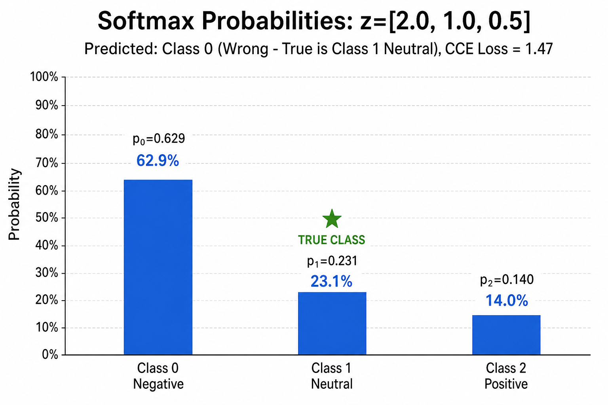

**Given:** z = [2.0, 1.0, 0.5], y = [0, 1, 0] (true class = 1 = neutral)

---

#### (i) Softmax probabilities

```
exp(2.0) = 7.389,  exp(1.0) = 2.718,  exp(0.5) = 1.649
Σ = 7.389 + 2.718 + 1.649 = 11.756

p₀ = 7.389/11.756 = 0.629  (negative)
p₁ = 2.718/11.756 = 0.231  (neutral) ← TRUE CLASS
p₂ = 1.649/11.756 = 0.140  (positive)
```

**Answer (i): p = [0.629, 0.231, 0.140]**

Highest probability goes to class 0 (negative), not the true class.

---

#### (ii) Categorical Cross-Entropy

```
L = −Σ y_k · log(p_k)
```

Only y₁ = 1 contributes (one-hot):

```
L = −log(0.231) = 1.47
```

**Answer (ii): L ≈ 1.47**

High loss because true class probability (0.231) is low.

---

#### (iii) & (iv) Prediction

```
Predicted class = argmax(p) = 0 (negative)
True class = 1 (neutral)  →  WRONG
```

**Exam answer:** p = [0.629, 0.231, 0.140], CCE = 1.47, predicted class 0, **incorrect** (true = 1).

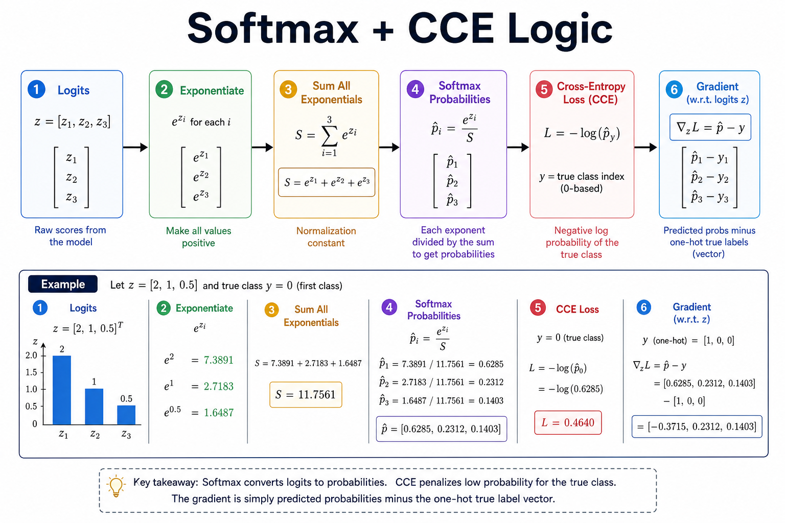

---

### Q4(b) [5 marks]

> **QUESTION:** Complete softmax training code blanks.

```python
Blank 1: exp_Z/np.sum(exp_Z,axis=1,keepdims=True)   # softmax normalize
Blank 2: np.dot(X_batch, W)                          # logits z = XW
Blank 3: np.dot(X_batch.T,(Y_pred-Y_batch))/len(Y_batch)  # gradient = p̂−y
Blank 4: W - lr*gradient                             # weight update
Blank 5: np.argmax(np.dot(X,W),axis=1)               # predicted class
```

---

### Q4(c) [6 marks]

> **QUESTION:** Confusion matrix (1000 test): True Cat [280,15,5], True Dog [20,350,30], True Bird [10,40,250].  
> **(i)** Precision and recall for Bird class. Identify TP, FP, FN. [3 marks]  
> **(ii)** Most bird errors → Dog. Does 88% overall accuracy guarantee good per-class performance? [3 marks]

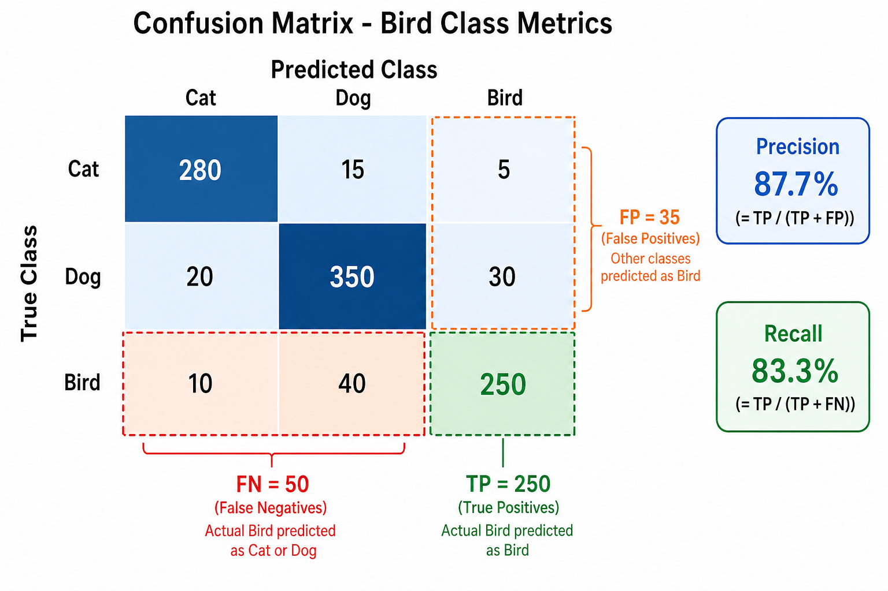

#### (i) Bird class metrics

From Bird row (True Bird): [10, 40, 250] → Bird column is last.

```
TP = 250  (correctly classified as Bird)
FP = 5 + 30 = 35  (Cat/Dog wrongly called Bird)
FN = 10 + 40 = 50  (Bird wrongly called Cat/Dog)

Precision = TP/(TP+FP) = 250/285 = 87.7%
Recall    = TP/(TP+FN) = 250/300 = 83.3%
```

**Exam answer:** TP=250, FP=35, FN=50. Precision = **87.7%**, Recall = **83.3%**.

#### (ii) Per-class performance

**Interpretation:** Bird is most confused with Dog (40 errors) — shared visual features (four legs, fur). Overall 88% accuracy can hide a class with 50% recall. Always check per-class metrics.

**Exam answer:** Most Bird errors → Dog (shared features). **No** — 88% overall accuracy does not guarantee good per-class performance; check precision/recall per class.

---

### Q4(d) [3 marks]

> **QUESTION:** Chest X-ray, 5 classes imbalanced. Model A: 92% acc, 45% TB recall. Model B: 85% acc, 78% TB recall. Which to deploy?

**Interpretation:** Missing TB (contagious, fatal) is unacceptable. 7% accuracy drop is a worthwhile trade for nearly doubling TB detection (45% → 78%).

**Exam answer:** Deploy **Model B** — missing tuberculosis is clinically unacceptable. Lower overall accuracy is acceptable when critical-class recall improves from 45% to 78%.

---

## Question 5 — DFNN Forward & Backprop

### Q5(a) [6 marks]

> **QUESTION:** 2-layer DFNN binary classification. Input: 2 features. Hidden: 2 neurons ReLU. Output: 1 neuron sigmoid.  
> W¹=[[1.0,0.5],[-0.5,1.5]], b¹=[0.2,−0.3], w²=[1.2,0.8]ᵀ, b²=0.1.  
> x=[0.5,0.8]ᵀ, y=1. Calculate: (i) hidden pre-activation, (ii) hidden activations after ReLU, (iii) output prediction, (iv) BCE loss.

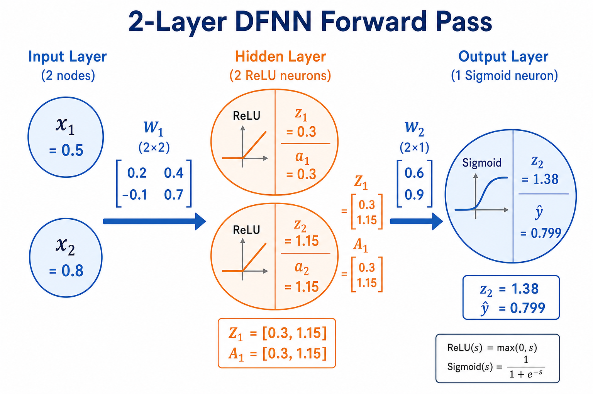

**Given:** x = [0.5, 0.8], y = 1

---

#### (i) Hidden pre-activation Z¹

```
z₁⁽¹⁾ = 0.5(1.0) + 0.8(−0.5) + 0.2 = 0.5 − 0.4 + 0.2 = 0.3
z₂⁽¹⁾ = 0.5(0.5) + 0.8(1.5) + (−0.3) = 0.25 + 1.2 − 0.3 = 1.15
Z¹ = [0.3, 1.15]
```

**Answer (i): Z¹ = [0.3, 1.15]**

---

#### (ii) ReLU activation

```
ReLU(z) = max(0, z)
A¹ = [max(0, 0.3), max(0, 1.15)] = [0.3, 1.15]
```

Both positive → ReLU passes them through unchanged.

**Answer (ii): A¹ = [0.3, 1.15]**

---

#### (iii) Output prediction

```
z² = 0.3(1.2) + 1.15(0.8) + 0.1 = 0.36 + 0.92 + 0.1 = 1.38
ŷ = σ(1.38) = 1/(1 + e^(−1.38)) ≈ 0.799
```

**Answer (iii): ŷ ≈ 0.799**

Model predicts class 1 with 79.9% confidence — correct direction but not fully confident.

---

#### (iv) Binary Cross-Entropy Loss

```
L = −[y·log(ŷ) + (1−y)·log(1−ŷ)]
With y=1:  L = −log(0.799) ≈ 0.225
```

**Answer (iv): L ≈ 0.225**

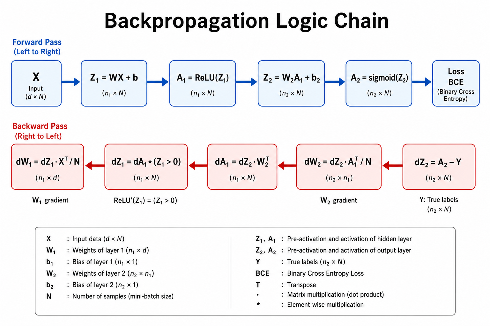

**Exam answer:** Z¹ = [0.3, 1.15], A¹ = [0.3, 1.15], ŷ ≈ 0.799, BCE ≈ 0.225.

---

### Q5(b) [5 marks]

> **QUESTION:** Complete 2-layer DFNN forward/backward code (ReLU blank, forward A1, dW2, dA1, dW1).

```python
Blank 1: np.maximum(0, Z)           # ReLU activation
Blank 2: relu(Z1)                   # forward hidden layer
Blank 3: np.dot(A1.T, dZ2) / N      # dW2 = A1ᵀ · dZ2
Blank 4: np.dot(dZ2, W2.T)          # dA1 = dZ2 · W2ᵀ (backprop to hidden)
Blank 5: np.dot(X.T, dZ1) / N       # dW1 = Xᵀ · dZ1
```

**Backprop chain:** dZ2 = A2−Y → dW2 → dA1 → dZ1 = dA1⊙(Z1>0) → dW1

---

### Q5(c) [6 marks]

> **QUESTION:** Sentiment DFNN: Input(1000) → Hidden(n₁) → Output(5). 50,000 samples. n₁=8 (ignore bias).  
> **(i)** Total parameters? Reasonable for 50K samples? [3 marks]  
> **(ii)** High train acc, low test acc — two architectural causes? [3 marks]

#### (i) Parameter count

```
Layer 1: 1000 × 8 = 8,000
Layer 2: 8 × 5 = 40
Total = 8,040 parameters
Ratio: 50,000 / 8,040 ≈ 6.2 samples per parameter
```

**Interpretation:** Rule of thumb is 10–20+ samples per parameter. 6.2 is borderline — acceptable for a simple task but watch for overfitting.

**Exam answer:** **8,040 parameters**. Borderline reasonable — ~6 samples/param; not severely overparameterized but regularization recommended.

#### (ii) Train high, test low

**Cause 1 — Overfitting:** Model memorizes training noise. Fix: reduce hidden neurons, add dropout/L2.

**Cause 2 — Insufficient regularization:** 1000 input features allow memorizing specific word combos. Fix: early stopping, data augmentation.

**Exam answer:** (1) Model too large → memorization. (2) No regularization → fails to generalize. Fixes: dropout, L2, early stopping.

---

### Q5(d) [3 marks]

> **QUESTION:** Mobile image classification, 1M images/day. Arch A: 50K params, 87% acc, 5ms, 200MB. Arch B: 850K params, 89% acc, 45ms, 3.4GB. Which for mobile? Would recommendation change for cloud?

**Time analysis:**

```
A: 5ms × 1M = 1.4 hours/day
B: 45ms × 1M = 12.5 hours/day  (+11 hours!)
```

**Exam answer:** **Mobile → A** (5ms latency, 200MB fits device; 2% accuracy gap not worth 11 extra hours). **Cloud → B** (unlimited compute/storage; 2% accuracy matters at scale).

---

# PAPER 2 — Mid QP 2024 (Closed Book, 30 marks, 2 hrs)

---

### Mid Q1 [6 marks]

> **QUESTION:** Design a fully connected MLP with **minimum** hidden layers and nodes for 100% accuracy on the decision boundary shown (classes +1/−1). Step activation at all nodes: output=+1 if weighted input ≥ threshold (write threshold inside node), else −1.

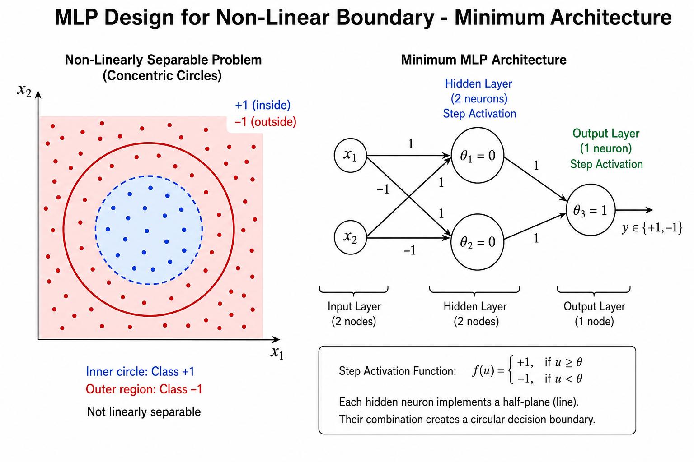

**Key idea:** Concentric circles / ring boundary = **not linearly separable**. One perceptron = one line → fails.

**Minimum architecture:** Input(2) → **Hidden(2)** → Output(1)

- H1: detects inner circle (fires +1 inside inner radius)
- H2: detects outer circle (fires +1 inside outer radius)
- Output: combines H1, H2 for final +1/−1

**Exam answer:** 1 hidden layer, 2 hidden neurons. Single perceptron fails — need non-linear feature composition via hidden layer. Label thresholds inside each node in diagram.

---

### Mid Q2 [5 marks]

> **QUESTION:**  
> **(a)** Input 8×8, kernel 3×3, stride 1, no padding → output shape? [2M]  
> **(b)** 5 filters applied → shape? [1M]  
> **(c)** MaxPool 4×4, stride 2 on (b) → final shape? [2M]

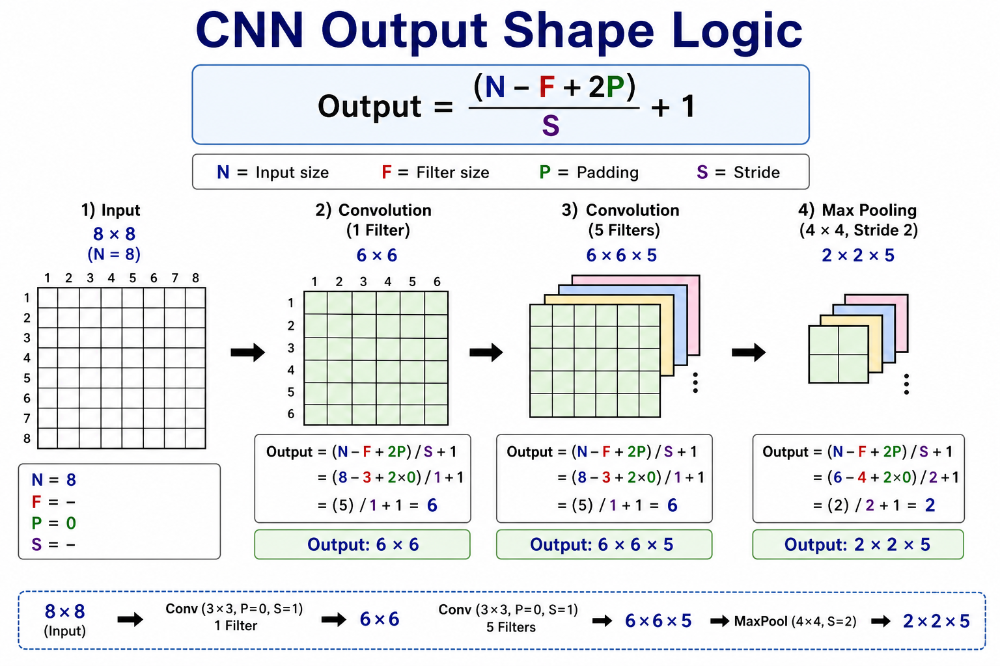

**Formula:** `Output = (N − F + 2P) / S + 1`

#### (a) Conv layer

```
= (8 − 3 + 0) / 1 + 1 = 6
Shape: 6×6
```

One 3×3 filter slides over 8×8 → 6×6 feature map.

#### (b) 5 filters

Each filter produces one 6×6 map → **6×6×5**

#### (c) MaxPool

```
= (6 − 4) / 2 + 1 = 2
Shape: 2×2×5
```

**Exam answer:** (a) **6×6** | (b) **6×6×5** | (c) **2×2×5**

---

### Mid Q3 [4 marks]

> **QUESTION:** Mr Ram has data_1.csv (1M labelled examples) and data_2.csv (100 labelled). Mr Rakesh trains from scratch on data_2. Mr Ram pretrains on data_1 then transfer-learns on data_2. Differentiate approaches, advantages, problems, fixes. What problem will Rakesh face? How does Ram's approach fix it?

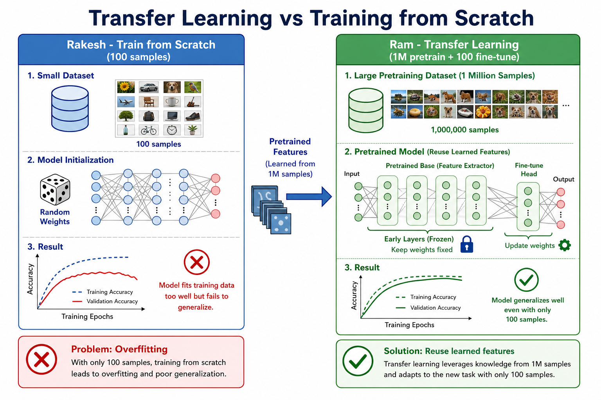

| | Rakesh (100 samples, scratch) | Ram (pretrain 1M → fine-tune 100) |
|--|------|------|
| Problem | **Severe overfitting** | Domain mismatch, catastrophic forgetting |
| Fix | More data, simpler model | Freeze early layers, small LR |

**Exam answer:** Rakesh faces **overfitting** — 100 samples insufficient to learn good features from scratch. Ram pretrains on 1M to learn general features (edges, textures), then fine-tunes only top layers on 100 examples — transfers knowledge, needs far less target data.

---

### Mid Q4 [5 marks]

> **QUESTION:** E(w₁,w₂) = 3w₁² + 4w₂² + 2w₁w₂. Initial (w₁,w₂)=(0.5,0.5), η=0.1.  
> **(a)** Calculate ∂E/∂w₁ and ∂E/∂w₂. [3M]  
> **(b)** New weights at time t. [2M]

#### (a) Gradients

Differentiate first, then substitute:

```
∂E/∂w₁ = 6w₁ + 2w₂  →  6(0.5) + 2(0.5) = 3 + 1 = 4
∂E/∂w₂ = 8w₂ + 2w₁  →  8(0.5) + 2(0.5) = 4 + 1 = 5
```

#### (b) Weight update

```
w₁_new = 0.5 − 0.1(4) = 0.1
w₂_new = 0.5 − 0.1(5) = 0.0
```

**Exam answer:** Gradients = **(4, 5)**. New weights = **(0.1, 0.0)**.

---

### Mid Q5 [5 marks]

> **QUESTION:**  
> **(a)** Two benefits of convolution layers over fully connected for image classification. [2M]  
> **(b)** Training accuracy **decreasing** after few epochs — interpretation and fix? [3M]

#### (a) Conv vs FC

1. **Parameter sharing** — one 3×3 filter (9 params) applied everywhere vs millions of FC connections
2. **Local connectivity / translation equivariance** — detects edges/patterns wherever they appear

#### (b) Training accuracy decreasing

**NOT overfitting** (that = train high, val low). Training acc itself dropping = **divergence**.

**Cause:** Learning rate too high — overshooting minimum.

**Fix:** Reduce η, use LR scheduler, check data/labels.

**Exam answer:** (a) Parameter sharing + spatial structure preservation. (b) Divergence from high LR → reduce learning rate.

---

### Mid Q6 [5 marks]

> **QUESTION:**  
> **(a)** List hyperparameters for training a neural network. [2M]  
> **(b)** ANN can classify images — why is CNN preferred? [3M]

**Exam answer:** (a) η, batch size, epochs, layers, neurons, activation, optimizer, dropout, L2. (b) CNN: 27 params/filter vs millions for FC on same image; preserves spatial structure that ANN destroys by flattening pixels.

---

# PAPER 3 — EC3 Mid-Sem 2026 (Open Book, 120 marks, 2 hrs)

---

### EC3 Q1 — Hospital X-ray DFNN

> **QUESTION (a):** x=[0.8,−0.5,0.2], w=[0.4,0.1,−0.2], b=0.5, ReLU. (i) Inference [2M]. (ii) Softmax formula for 10-class — why appropriate? [2M]. (iii) Define ReLU, Leaky ReLU, Softmax formulas [3M].  
> **QUESTION (b):** (i) Why can't perceptron solve 10-class? Reference linear separability, XOR [4M]. (ii) Vanishing gradients in early layers — cause, impact, TWO fixes [4M].

#### (a)(i) Inference

```
z = 0.4(0.8) + 0.1(−0.5) + (−0.2)(0.2) + 0.5 = 0.73
Output = ReLU(0.73) = 0.73
```

#### (a)(ii) Softmax for 10-class

```
p_i = exp(z_i) / Σ_{j=1}^{10} exp(z_j)
```

**Why:** Converts 10 raw logits into valid probability distribution (values in (0,1), sum to 1) — required for mutually exclusive disease classes.

#### (a)(iii) Activations

| Function | Formula |
|----------|---------|
| ReLU | max(0, z) |
| Leaky ReLU | max(αz, z), α≈0.01 |
| Softmax | exp(z_i)/Σexp(z_j) |

#### (b)(i) Perceptron limitation

One perceptron = one linear boundary → 2 regions only. 10-class needs 10 non-linear regions. XOR is simplest failure case — medical images are far more complex.

#### (b)(ii) Vanishing gradients

**Cause:** Sigmoid saturation → derivatives ≈ 0 → gradients shrink exponentially to early layers.

**Impact:** Early layers barely update → can't learn low-level features (edges in X-rays).

**Fix 1:** ReLU (gradient = 1 for positive inputs). **Fix 2:** Skip/residual connections (gradient highway).

**Exam answer:** (a)(i) z=0.73, output=0.73. (a)(ii) Softmax gives valid 10-class probabilities. (b)(i) One linear boundary can't partition into 10 classes. (b)(ii) Sigmoid saturation → ReLU + skip connections.

---

### EC3 Q2 — Churn Prediction

> **QUESTION:** Telecom churn binary prediction. (a)(i) Output activation + loss + justify pairing [3M]. (a)(ii) P(churn)=0.73, threshold 0.5 — predicted class? [2M]. (b)(i) 88% acc but 54% churn recall — why DFNN better? [2M]. (b)(ii) ReLU in H1, Leaky ReLU in H2 — justify [3M]. (b)(iii) Design complete DFNN architecture [5M].

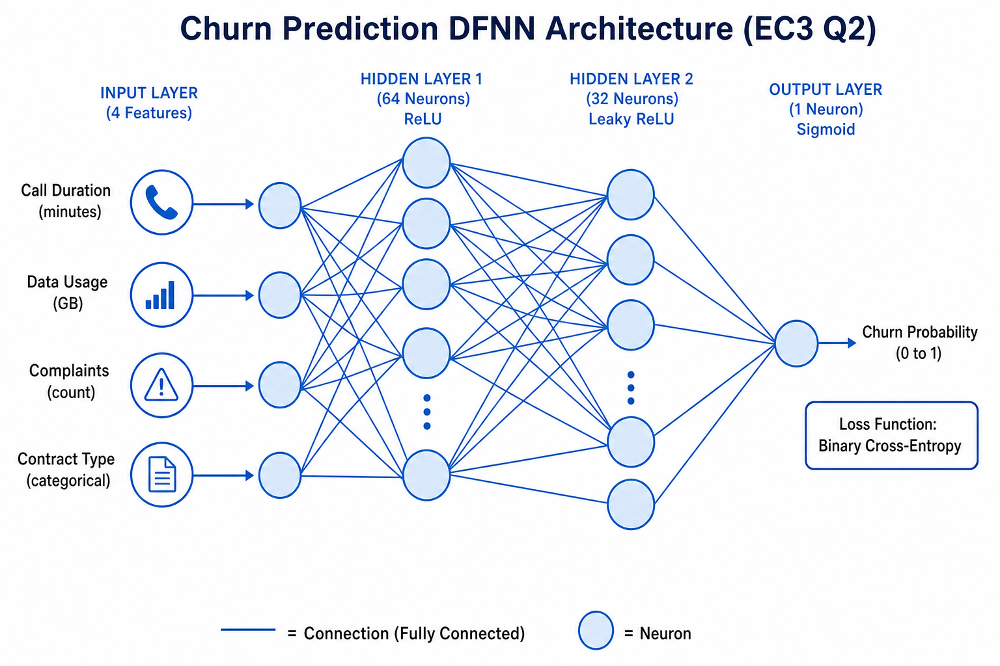

**Exam answer:**
- **(a)(i)** Sigmoid + BCE — sigmoid outputs probability in (0,1); BCE penalizes wrong confidence on binary labels.
- **(a)(ii)** P=0.73 > 0.5 → predict **Churn**.
- **(b)(i)** DFNN captures non-linear feature interactions (tenure × contract × usage) that linear models miss.
- **(b)(ii)** ReLU in H1 for fast training; Leaky ReLU in H2 prevents dead neurons in deeper layer.
- **(b)(iii)** Input(4) → H1(64, ReLU) → H2(32, LeakyReLU) → Output(1, Sigmoid)

---

### EC3 Q3 — Skin Cancer CNN

> **QUESTION:** 8000 images, 7 classes, melanoma 600 vs benign 3200. ResNet-50 92% acc, 68% melanoma sensitivity. 8GB GPU, <500ms inference. (a) Transfer learning or scratch? [3M]. ResNet FC replaced 2048→512→7, Dropout 0.5 — param change? [4M]. (b) Edge CNN 224×224×3, calculate Layer1 and Layer8 params [3M]. 4-channel infrared — Layer1 change? Layer3/8? [3M]. GAP option — choose one, param count, adv/disadv [3M].

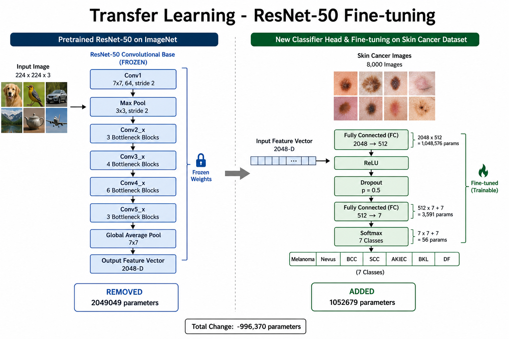

**Exam answer:**
- Transfer learning **YES** — 8000 images insufficient to train deep CNN from scratch; ImageNet pretrained features transfer.
- FC replacement: removed ~2,049,000 params, added ~1,052,679.
- L1 params = **2432** = (3×3×3+1)×64. L8 params = **25,690,368**.
- 4-channel input: L1 only changes (+800 params for extra channel); L3/L8 unchanged.
- GAP = **1290 params** — fewer params, less overfitting, but loses spatial localization.

---

### EC3 Q4 — RNN / GRU

> **QUESTION:** Factory anomaly, d=10, h=20. (a) RNN vs GRU params [2M]. Best model for edge? [3M]. (b) x_t=[2,1], h_{t-1}=[0.5,−0.5], Vanilla RNN and GRU one step [5M]. (c) GRU BPTT: ∂L/∂h₃=1, z_t=0.9 for t=2,3 — find ∂L/∂h₁ [1M]. GRU vs vanishing grad [1M]. RNN vs Transformer for streaming [1M].

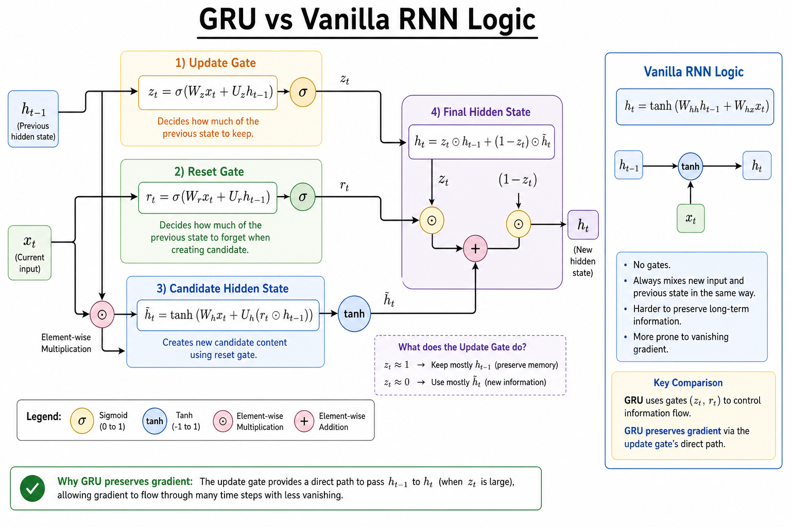

**Exam answer:**
- Vanilla RNN params = d·h + h·h + h = 10×20+20×20+20 = **620**. GRU ≈ 3× = **1860**.
- Edge deployment → **GRU** (better long-range memory than vanilla RNN, fewer params than Transformer).
- Vanilla h ≈ [0.80, 0.10]; GRU h ≈ [0.53, −0.24] (gates control information flow).
- ∂L/∂h₁ = 0.9 × 0.9 × 1 = **0.81** (GRU gates preserve gradient).
- Streaming sensor data → **RNN/GRU** (O(1) per step) over Transformer (O(L²) memory).

---

### EC3 Q5 — Attention

> **QUESTION:** (a) q₃=[2,7], k₁=k₂=[3,1], k₃=[7,3], v₁=v₂=[3,1], v₃=[8,3] — scaled dot-product attention [3M]. Missing mechanism for next-item prediction? [2M]. (b) Additive attention on health records [3M]. Cross vs multi-head attention scenarios [2M]. Compare dot vs additive [2M].

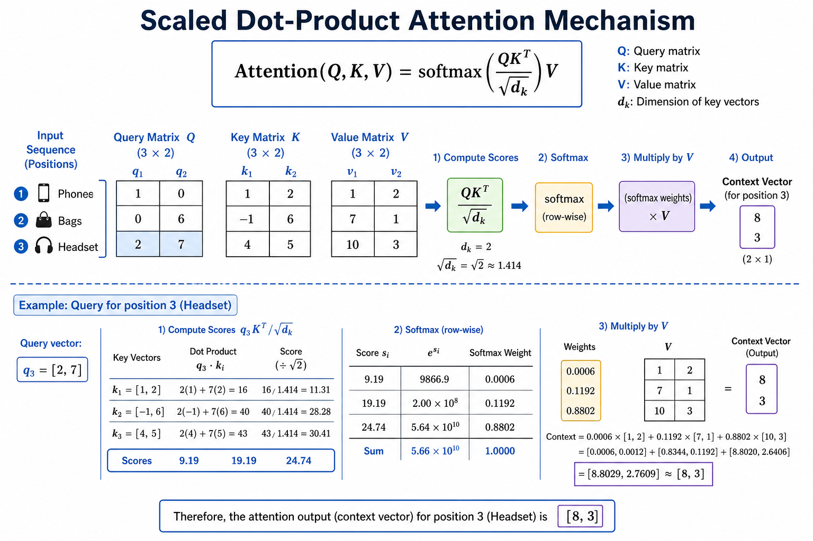

**Scaled dot-product for q₃:**

```
score(k₁) = q₃·k₁ = 6+7 = 13
score(k₃) = q₃·k₃ = 14+21 = 35  ← highest
After softmax → weight ≈ 1 on v₃
context = weighted sum ≈ [8, 3]
```

**Exam answer:** context ≈ **[8, 3]**. Missing **causal/mask** (can't peek at future tokens). Cross-attention for external DB lookup; multi-head for diverse clinical signal types. Dot-product: fast, parallel; Additive: more expressive for complex relationships.

---

### EC3 Q6 — Transformers

> **QUESTION:** Clinical summarisation. (a) What does positional encoding do? Failure without it? [3M]. Match encoder/decoder to NER, generation, generation, summarisation [4M]. (b) d_model=512, 8 heads, d_ff=2048, L=128 — tensor dims [3M], encoder params [3M], Pre-LN vs Post-LN [3M]. (c) BERT vs GPT vs T5 for summarisation [2M]. O(L²) bottleneck + mitigation [2M].

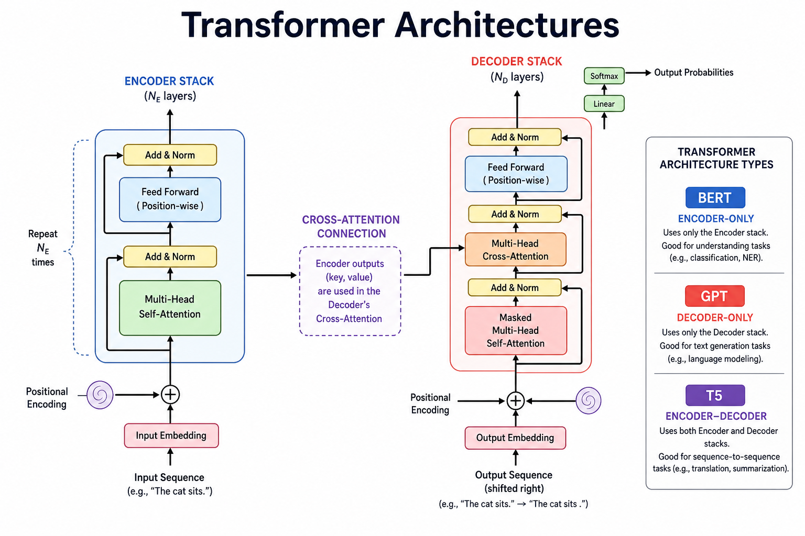

**Exam answer:**
- Positional encoding injects token order — without it, self-attention is permutation-invariant (can't distinguish word order).
- NER → **BERT** (encoder-only), Generation → **GPT** (decoder-only), Summarisation → **T5** (encoder-decoder).
- Encoder layer ≈ **3.15M params**. Pre-LN: more stable training; Post-LN: original Transformer design.
- **T5** best for summarisation (seq2seq). O(L²) bottleneck → sliding window / Linformer / Longformer.

---

### EC3 Q7 — Optimizers

> **QUESTION:** (a) Match curves A–D to SGD, Momentum, RMSprop, Adam [4M]. (b) LR schedules X,Y,Z to high/low/cosine annealing [4M]. Val loss↑ train↓ — phenomenon + fix [3M]. Diagnose Runs 1–4 [4M]. Run1 fix with 2 techniques [3M]. (c) BatchNorm effect on Run4 [2M].

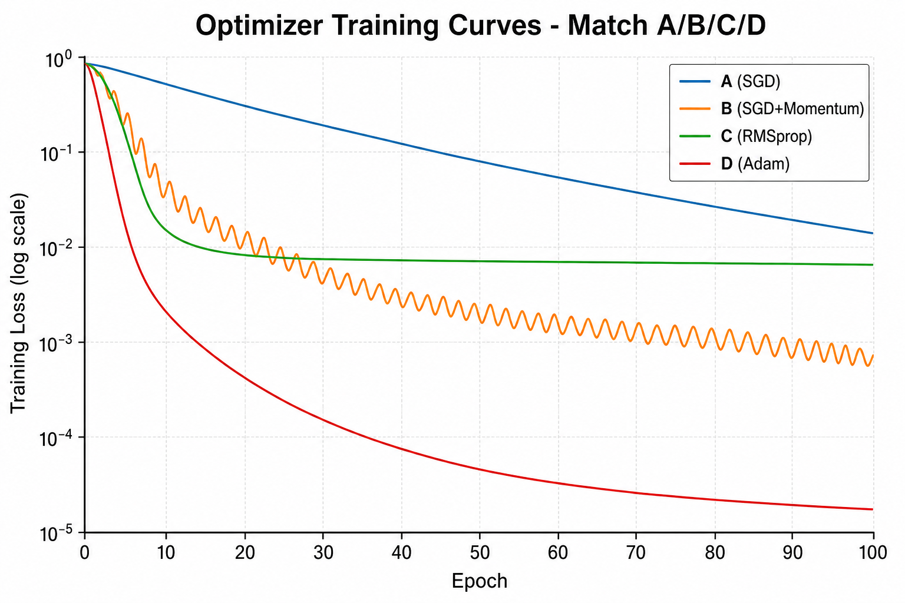

**Exam answer:**
- A=SGD (slow, noisy), B=Momentum (faster convergence), C=RMSprop (adaptive per-dim), D=Adam (fastest, smoothest).
- X=high constant LR, Y=low constant LR, Z=cosine annealing.
- Val↑ train↓ = **overfitting** → weight decay, dropout, early stopping.
- Run1=overfit → Dropout + L2. BatchNorm on Run4 → stable gradients, faster convergence, acts as regularizer.

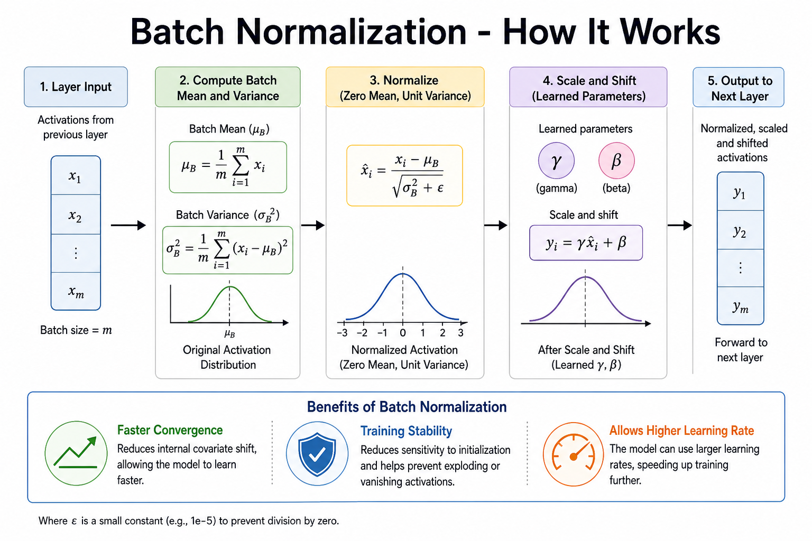

---

# DERIVATIONS

## BCE: ∂L/∂z = ŷ − y

**Step 1 — Write the loss:**

```
L = −[y·log(ŷ) + (1−y)·log(1−ŷ)]
```

**Step 2 — ∂L/∂ŷ:**

```
∂L/∂ŷ = −y/ŷ + (1−y)/(1−ŷ)
```

**Step 3 — Sigmoid derivative:** ∂ŷ/∂z = ŷ(1−ŷ)

**Step 4 — Chain rule:**

```
∂L/∂z = (∂L/∂ŷ)(∂ŷ/∂z) = [−y/ŷ + (1−y)/(1−ŷ)] · ŷ(1−ŷ) = ŷ − y
```

**Step 5 — Weight gradient:** ∇wL = (ŷ−y)x

**Exam answer:** BCE + Sigmoid gives gradient **ŷ − y** — prediction minus target.

## CCE: ∇z L = p̂ − y

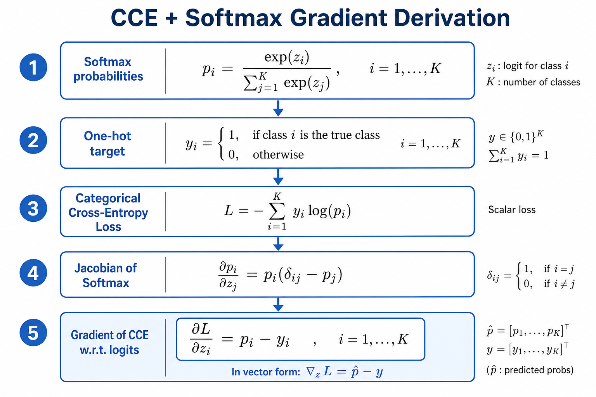

**Key steps:**
1. L = −log(p̂_k) for true class k
2. Softmax Jacobian: ∂p̂_i/∂z_j = p̂_i(δ_ij − p̂_j)
3. Chain rule → **p̂ − y**
4. ∂L/∂W = (p̂−y)xᵀ

**Exam answer:** CCE + Softmax gives **p̂ − y** — same form as BCE! Both losses paired with their activation give (prediction − target).

---

# Exam checklist

- [ ] Perceptron: check ŷ vs y BEFORE updating
- [ ] Perceptron **+**, logistic **−**
- [ ] BCE gradient = **ŷ − y**
- [ ] CNN: write formula first, then substitute
- [ ] Imbalanced: precision/recall not just accuracy
- [ ] Always add **interpretation** after calculation — examiners reward understanding, not just numbers

*You are prepared. One question at a time.*
